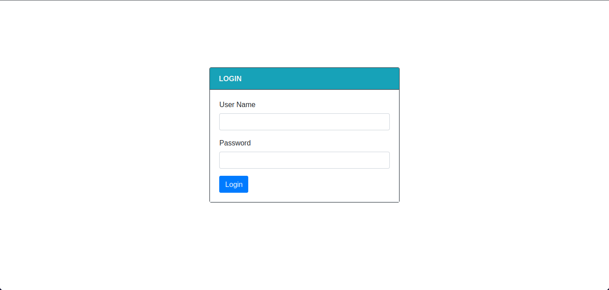
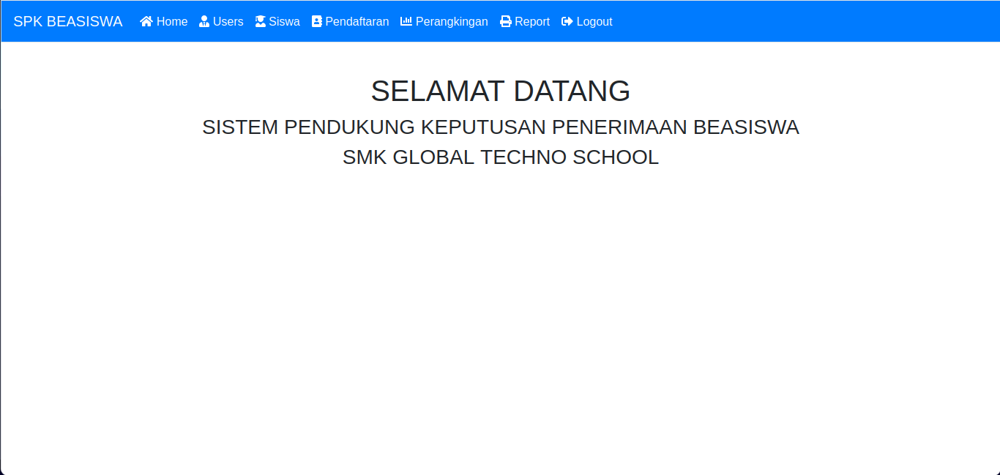
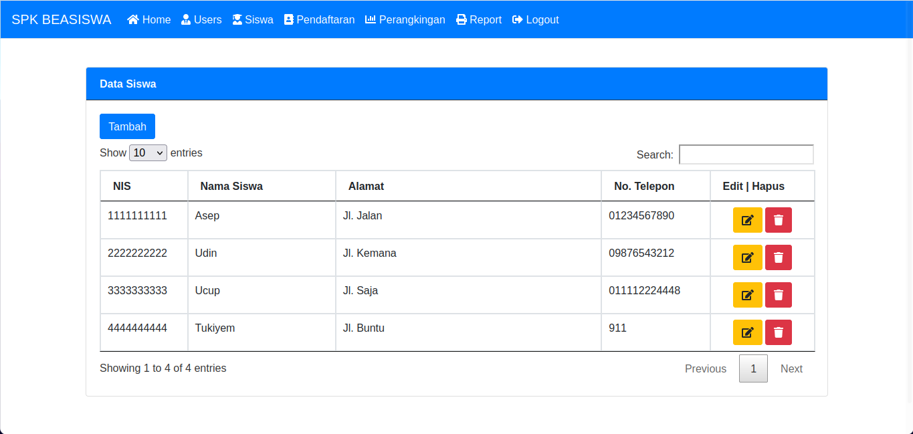
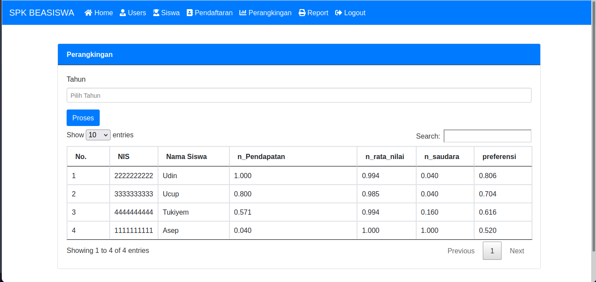
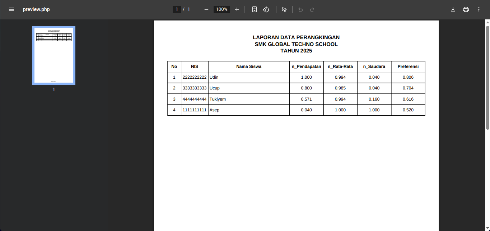

# SPK Beasiswa - Sistem Pendukung Keputusan Penerimaan Beasiswa

Aplikasi web berbasis PHP untuk membantu proses seleksi dan perangkingan penerima beasiswa di SMK Global Techno School. Sistem ini menggunakan metode perangkingan berdasarkan beberapa kriteria seperti pendapatan orang tua, nilai rata-rata, dan jumlah saudara.

## Penggunaan

- **Login**: Masukkan username dan password.
- **Navigasi**: Menu akan muncul sesuai level user.
- **Manajemen Data**: Gunakan menu untuk menambah, mengubah, atau menghapus data siswa, users, dan pendaftaran.
- **Perangkingan**: Pilih tahun, klik "Proses" untuk menghitung perangkingan.
- **Laporan**: Pilih tahun, klik "Cetak" untuk download/preview PDF laporan perangkingan.

## Hak Akses User

- **Super Admin**: Kelola semua data (users, siswa, pendaftaran, perangkingan, laporan).
- **Sub Admin**: Kelola data siswa dan pendaftaran.
- **Pimpinan**: Hanya melihat perangkingan dan laporan.

Untuk mencoba website SPK ini anda dapat mengunjungi link berikut ini:

bagasabiyukumara.my.id/projects/spksaw/
- **Super Admin**:
  Username : superadmin
  Password : superadmin
- **Sub Admin**:
  Username : subadmin
  Password : subadmin
- **Pimpinan**:
  Username : pimpinan
  Password : pimpinan

---

## Tampilan Aplikasi

### 1. Halaman Login


### 2. Dashboard


### 3. Data Siswa


### 4. Perangkingan


### 5. Laporan PDF


---

## Fitur

- **Manajemen Siswa**: Tambah, ubah, hapus, dan tampilkan data siswa.
- **Manajemen Users**: Kelola akun pengguna dengan level akses (Super Admin, Sub Admin, Pimpinan).
- **Pendaftaran Beasiswa**: Input data pendaftaran siswa setiap tahun.
- **Perangkingan**: Proses perangkingan otomatis berdasarkan kriteria yang telah ditentukan.
- **Laporan**: Cetak laporan perangkingan dalam format PDF.
- **Autentikasi**: Login dan logout user.
- **Dashboard**: Navigasi menu dinamis sesuai level user.

## Struktur Direktori

```
.
├── assets/                 # Asset frontend (CSS, JS, gambar)
│   ├── css/
│   └── js/
├── fpdf/                   # Library FPDF untuk generate PDF
│   ├── fpdf.php
│   └── ...
├── config.php              # Konfigurasi koneksi database
├── index.php               # Halaman utama & router menu
├── login.php               # Halaman login
├── logout.php              # Logout session
├── tambah_siswa.php        # Form tambah siswa
├── update_siswa.php        # Form update siswa
├── hapus_siswa.php         # Proses hapus siswa
├── tampil_siswa.php        # Tabel data siswa
├── tambah_users.php        # Form tambah user
├── update_users.php        # Form update user
├── hapus_users.php         # Proses hapus user
├── tampil_users.php        # Tabel data user
├── tambah_pendaftaran.php  # Form tambah pendaftaran
├── update_pendaftaran.php  # Form update pendaftaran
├── hapus_pendaftaran.php   # Proses hapus pendaftaran
├── tampil_pendaftaran.php  # Tabel data pendaftaran
├── perangkingan.php        # Proses dan tabel perangkingan
├── report.php              # Form cetak laporan
├── preview.php             # Generate PDF laporan perangkingan
├── welcome.php             # Halaman selamat datang
└── ...
```

## Instalasi

1. **Clone repository**
   ```sh
   git clone <repo-url>
   cd beasiswa
   ```

2. **Konfigurasi Database**
   - Buat database MySQL, misal: `beasiswa`.
   - Import struktur data awal ke database.
   - Edit file [`config.php`](config.php) dan sesuaikan parameter koneksi database:
     ```php
     $conn = new mysqli("localhost", "username", "password", "beasiswa");
     ```

3. **Konfigurasi Web Server**
   - Pastikan web server (Apache/Nginx) dan PHP sudah terpasang.
   - Pastikan ekstensi PHP `mysqli` dan `gd` aktif.
   - Pastikan folder `fpdf/` tidak dihapus.

4. **Akses Aplikasi**
   - Buka browser dan akses `http://localhost/beasiswa/login.php`
   - Login menggunakan akun yang sudah ada di tabel `users`.

## Dependensi

- PHP >= 5.6
- MySQL/MariaDB
- [FPDF](https://www.fpdf.org/) (sudah termasuk di folder `fpdf/`)
- Bootstrap 4 (CSS & JS, sudah di folder `assets/`)
- jQuery, DataTables, Chosen (sudah di folder `assets/`)

## Lisensi

Aplikasi ini menggunakan library FPDF yang berlisensi Freeware. Kode aplikasi dapat digunakan dan dimodifikasi untuk kebutuhan non-komersial.

---

**Developed by:**  
Bagas Abiyu Kumara
